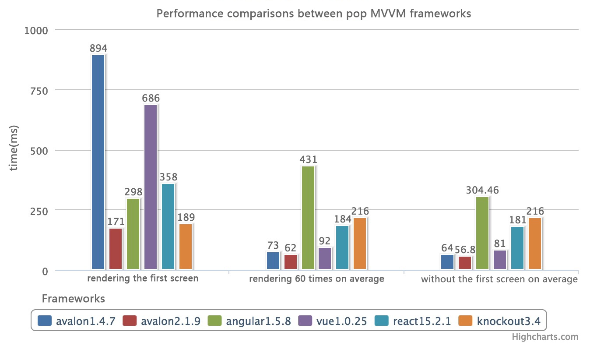

      

          <h1>avalon 2</h1>
          
a mini, easy and amazing front-end MVVM framework

      

Data from `index.html`, `index.*.html` in [perf](https://github.com/RubyLouvre/avalon/tree/master/perf)

